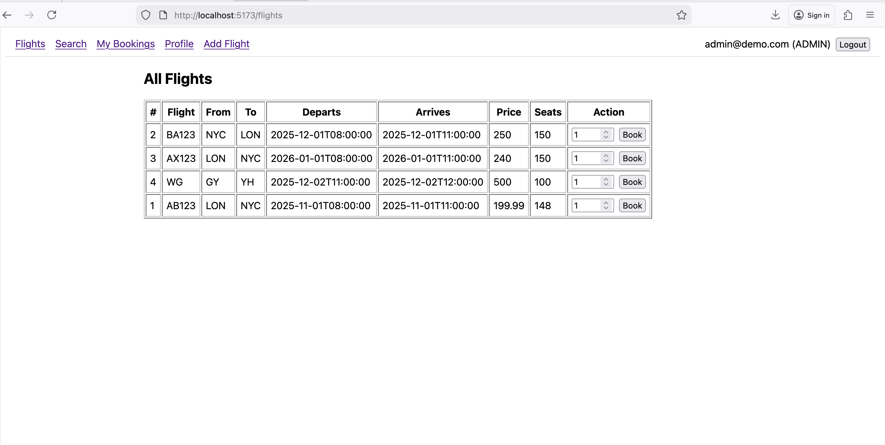
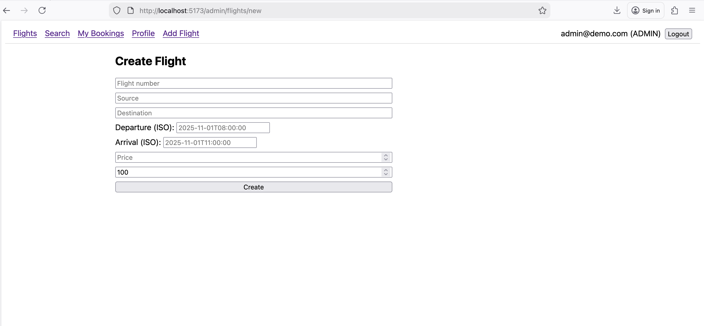
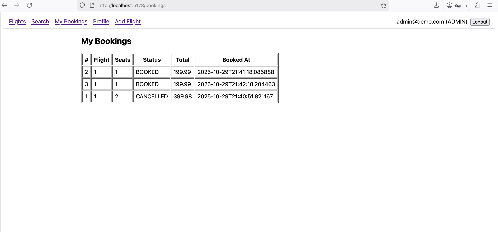
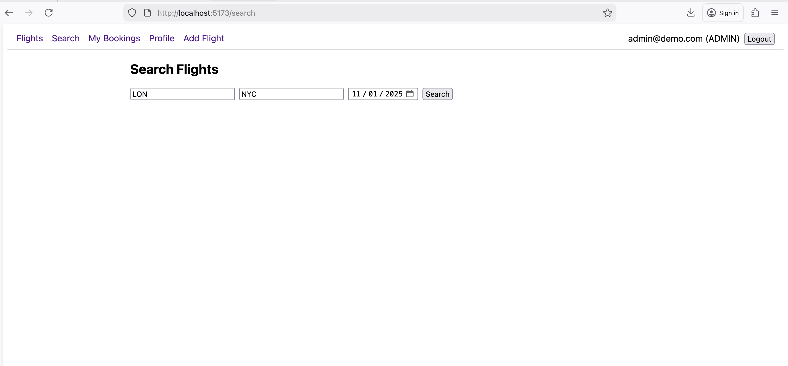

# Flight Booking App (Spring Boot + React)

This is a simple flight booking system with a Spring Boot REST API and a React (Vite) frontend. Auth is JWT-based. Data is stored in PostgreSQL.

## Project structure
- `src/` – Spring Boot backend (API, JWT auth, JPA)
- `frontend/` – React UI (Vite dev server with proxy to the API)
- `docker-compose.yml` – local PostgreSQL for development

## Quick start

1) Start Postgres locally (via Docker):

```bash
docker compose up -d
```

This starts a postgres:15 container exposing 5432 with DB `flightdb`, user `postgres`, password `password`.

2) Run the backend:

```bash
mvn spring-boot:run
```

- Swagger UI: http://localhost:8080/swagger-ui.html

3) Run the frontend (optional):

```bash
cd frontend
npm install
npm run dev
```

- Vite dev server: http://localhost:5173 (proxies `/api` to http://localhost:8080)

## Configuration
Backend config lives in `src/main/resources/application.yml` with sensible defaults:
- spring.datasource.url: `jdbc:postgresql://localhost:5432/flightdb`
- spring.datasource.username: `postgres`
- spring.datasource.password: `password`
- JPA `ddl-auto=update`

You can override with env vars: `JDBC_DATABASE_URL`, `JDBC_DATABASE_USERNAME`, `JDBC_DATABASE_PASSWORD`.

JWT settings are under `app.jwt.*`.

## Default admin
On startup a default admin is created:
- email: `admin@demo.com`
- password: `admin123`

## Endpoints (high level)
- Auth: `POST /users` (register), `POST /login` (returns `{ token }`)
- Users: `GET /users/{id}` (profile)
- Flights: `GET /flights`, `GET /flights/search?source=BLR&destination=DEL&date=2025-08-31`, `POST /flights` (admin)
- Bookings: `POST /bookings?userId={id}` (body `{ "flightId": 1, "seats": 2 }`), `GET /bookings/user/{id}`, `DELETE /bookings/{id}`

Send `Authorization: Bearer <token>` for protected endpoints.

## Notes
- Database: PostgreSQL. A local dev DB is provided via `docker-compose.yml`.
- OpenAPI/Swagger available at `/swagger-ui.html`.
- JPA schema is auto-managed (`ddl-auto=update`) for dev. For prod, use migrations and externalized secrets.

## 🖼️ Screenshots

### All Flights (Admin view)


### Create Flight (Admin)


### My Bookings


### Search Flights
